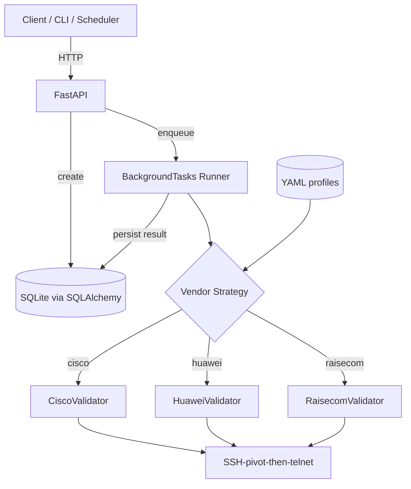

# Architecture

## Overview

netvalidate is a service that validates network device configurations against
declarative YAML profiles. It exposes a REST API and runs vendor-specific
validators using the Strategy pattern.

## Component diagram

## Request lifecycle

1. Client `POST /api/v1/validate` with vendor + device IP + profile name.
2. API validates the request body, confirms the profile exists, and creates a
   job row with `status=queued`.
3. The runner is dispatched as a FastAPI BackgroundTask.
4. The runner moves status to `running`, instantiates the vendor validator,
   collects raw output from the device (via SSH pivot when needed), evaluates
   the rules, and writes the result back to the DB.
5. Client polls `GET /api/v1/jobs/{job_id}` until `status=completed|failed`.

## Why a job model?

Validation can take 30s–2min per device (SSH connect, telnet through pivot,
multiple commands, parsing). A synchronous request would block the client and
hold an HTTP connection. The job model allows:

- Non-blocking submissions.
- Multiple concurrent validations.
- Auditability — every validation run is persisted.
- Future migration to a real queue (Celery, RQ, Arq) without API changes.

## Why Strategy pattern for vendors?

Each vendor has different CLIs, prompts, and command outputs. Encapsulating
each in its own class keeps:

- Cisco-specific parsing isolated from Huawei/Raisecom.
- The `collect()`/`evaluate()` contract uniform for the runner.
- Adding a new vendor a one-file change.

## Trade-offs and known limitations

- **BackgroundTasks** is in-process. If the API restarts mid-job, the job
  is orphaned in `running` status. For multi-worker production a real queue
  (Arq/RQ) would replace BackgroundTasks.
- **SQLite** is fine for single-instance deployments. Switching to PostgreSQL
  is a one-line change in `NETVALIDATE_DB_URL`.
- **Credentials** are referenced by name (`credentials_ref`) and resolved
  out-of-band. The repo never accepts plaintext passwords in API payloads.
